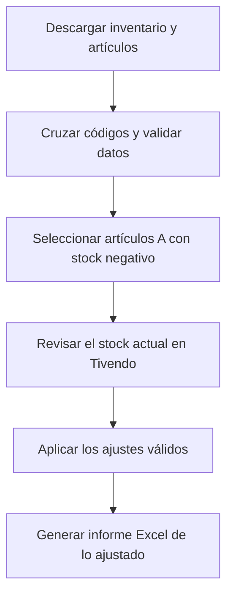

# Tivendo · Ajustes de stock negativo

**Automatización de inventario con validaciones por artículo e informe de resultados.**

Herramienta en Python que automatiza el ajuste positivo de artículos con stock negativo en una bodega específica de Tivendo. La configuración actual corresponde a `LIBERTADOR 1476`.

## El problema que resuelve

La revisión y el ajuste se realizaban manualmente. El programa descarga inventario y artículos, cruza sus identificadores y procesa los casos que cumplen las reglas definidas. Al finalizar, genera un Excel con los artículos realmente ajustados.

Este flujo reduce la repetición de consultas y cargas, y deja un resultado que se puede revisar después de la operación.

## Flujo



## Reglas y funciones

- Procesa códigos que comienzan con `A` y cuyo stock actual es estrictamente negativo.
- Omite stocks positivos, ceros y códigos `P`.
- Valida código, nombre y código de barras antes de cargar un artículo.
- Comprueba condiciones como artículos duplicados, inactivos o sin código de barras durante la preparación.
- Genera el informe final con los artículos efectivamente ajustados.
- Conserva resultados y diagnósticos locales para revisar las ejecuciones.
- Guarda los valores de acceso localmente en cada computador, fuera del código distribuido.

## Tecnologías

Python, Playwright, openpyxl y PyInstaller. Las pruebas utilizan `unittest`; GitHub Actions ejecuta la construcción y publicación del ejecutable.

## Uso del ejecutable

1. Descargar `TivendoStockNegativoPortable.exe` desde [Releases](https://github.com/FoorKeM/tivendo-stock-negativo/releases).
2. Ejecutarlo en el entorno autorizado para la bodega configurada.
3. Ingresar el acceso a Tivendo en la primera ejecución. El proceso comienza automáticamente después de la configuración.
4. Para cambiar el acceso, presionar `C` durante los primeros cinco segundos o utilizar la opción `--configurar`.
5. Revisar el progreso en la consola y seleccionar dónde guardar el informe Excel al terminar.

Edge o Chrome se ejecutan ocultos de forma predeterminada. La operación normal **modifica el stock en Tivendo**.

## Desarrollo y pruebas

El flujo de construcción utiliza Windows y Python 3.12. Desde la carpeta del repositorio:

```powershell
python -m venv .venv
.\.venv\Scripts\python.exe -m pip install -r requirements.txt
.\.venv\Scripts\python.exe -m unittest discover -s tests -v
.\.venv\Scripts\python.exe -m PyInstaller TivendoStockNegativo.spec --clean --noconfirm
```

Las pruebas existentes cubren selección de stocks negativos, conservación de códigos y decimales, rechazo de datos incompletos, lectura y escritura de configuración, informes y limpieza de archivos temporales. Son comprobaciones locales; no sustituyen una validación de la integración en un entorno autorizado.

Para revisar opciones del programa, consultar [`main.py`](main.py). Incluye `--solo-preparar`, `--simular-ajuste` y `--mostrar-navegador`. La preparación y la simulación también acceden a Tivendo; no son demostraciones desconectadas.

## Distribución y límites

El flujo de GitHub Actions se activa con cambios en `main`, ejecuta las pruebas, construye el EXE en Windows y publica una versión `v1.0.N`. Los commits exclusivamente documentales pueden omitir ese flujo mediante `[skip ci]`.

La automatización responde a una configuración y reglas operativas concretas. Cambios en la interfaz de Tivendo, en la bodega o en los formatos de exportación requieren revisar su compatibilidad. El informe refleja los ajustes realizados; no equivale a una auditoría completa del inventario.

---

Proyecto del catálogo de [Sebastian Araya — Sistemas, Logística y Automatización](https://github.com/FoorKeM).

